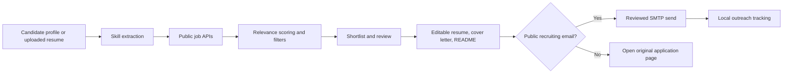

# Career Dispatch

[](https://github.com/Birukfm/career-dispatch/actions/workflows/security.yml)
[](https://github.com/Birukfm/career-dispatch/actions/workflows/codeql.yml)

A local-first workspace for discovering relevant jobs, cleaning up application documents, reviewing personalized packages, and sending deliberate one-to-one outreach. Built for people who need a clear, reviewable workflow rather than noisy automation.

Career Dispatch helps applicants organize a serious job search without inventing claims or skipping review. Every output starts from the candidate profile and stays editable before use. Messages can only be sent to recruiting addresses explicitly published in a public job listing.

## Highlights

- Searches permitted public job APIs without scraping protected websites
- Scores roles by discipline, experience, location, employment type, and resume skills
- Accepts PDF, DOCX, and TXT resumes for transient local skill extraction
- Generates editable ATS resumes, cover letters, README files, and application emails
- Provides three resume, three cover-letter, and three README templates
- Tracks discovered, shortlisted, drafted, sent, replied, and archived opportunities
- Sends reviewed applications through Gmail, Microsoft 365, or custom SMTP
- Enforces duplicate prevention, daily and weekly limits, and minimum send delays
- Stores profiles, credentials, jobs, and settings locally rather than in a hosted database
- Keeps sensitive credentials out of source control

## Product principles

### Cleanup, not invention

Document and content generation improves structure, wording, emphasis, and ATS readability. It does not invent credentials, metrics, responsibilities, employers, education, or achievements. Every generated artifact remains editable before use.

### Review before action

Career Dispatch does not provide an unattended bulk-send mode. Recipients, documents, and side effects must be reviewed before each application can be sent.

### Explicit inputs only

The application uses the candidate profile, uploaded resumes, and publicly documented job sources. It does not guess private details, harvest personal contacts, or purchase lists. Email sending is restricted to recruiting addresses found near application instructions in a public job post.

## Application flow



## Quick start

### Requirements

- Node.js 20 or newer
- npm
- An email account with SMTP access if you want to send applications

### Installation

```bash
git clone https://github.com/Birukfm/career-dispatch.git
cd career-dispatch
npm install
cp .env.example .env.local
cp data/profile.example.json data/profile.json
npm run dev
```

Open [http://localhost:3000](http://localhost:3000).

### Configure your profile

Edit `data/profile.json` with accurate information only:

- Contact details and professional links
- Verified skills and experience
- Factual achievements, education, and certifications

`data/profile.json` is ignored by Git. The committed `data/profile.example.json` contains placeholders only.

Optional public ATS boards can be configured in `.env.local`:

```dotenv
GREENHOUSE_BOARD_TOKENS=greenhouse
LEVER_SITE_NAMES=spotify
ASHBY_JOB_BOARD_NAMES=Ashby
WORKABLE_ACCOUNT_SUBDOMAINS=epignosis
```

Sources currently include Remote OK, Arbeitnow, Remotive, Jobicy, Greenhouse, Lever, Ashby, and Workable. LinkedIn, Indeed, Wellfound, and similar protected platforms are not scraped.

## Documents workspace

The `/documents` page includes editable template makers for:

1. **Resumes** — Classic ATS, Technical Focus, Compact Professional
2. **Cover letters** — Direct Professional, Product Story, Concise Value
3. **README files** — Product Workspace, Open Source Library, Portfolio Showcase

Each template supports live editing, previewing, copying, and download. README templates download as Markdown.

## Commands

```bash
npm run dev        # Start the local development server
npm run typecheck  # Check TypeScript
npm run build      # Create a production build
npm start          # Run the production build
npm audit          # Check dependencies for known vulnerabilities
```

## Privacy and security

Career Dispatch is local-first. Exclude the following from Git:

- `.env` files
- Personal profiles
- Email credentials and AI API keys
- Local job and outreach history
- Generated PDFs and resume source files

Credential files are written with restricted local permissions. API routes and the Documents and Configuration pages are limited to localhost by default. Before remote exposure, set `CAREER_DISPATCH_ACCESS_TOKEN` in `.env.local` and review [SECURITY.md](SECURITY.md).

This is not a hosted multi-user authentication system. Do not deploy it publicly without the access token and appropriate network controls.

## Responsible use

You are responsible for complying with job-board terms, email provider policies, privacy and anti-spam laws, employer communication preferences, and the accuracy of all submitted content. Do not use Career Dispatch to harvest contacts, invent claims, or distribute unsolicited messages.

## Author

Biruk Fisseha Mekonnen · Software Developer and ICT Operations Specialist  
[enehid.com](https://enehid.com) · [LinkedIn](https://www.linkedin.com/in/birukfm/)
